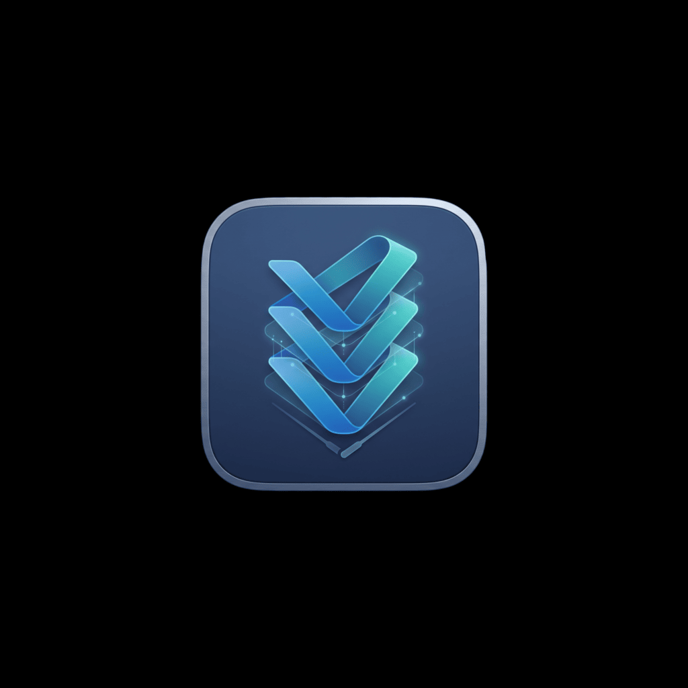

<p align="center">
  
</p>

# vsorch

Orchestrate multiple real VS Code workbenches inside a single desktop window.

vsorch is an Electron shell that hosts VS Code panes. It does not reimplement
any editor behavior — each pane is a full VS Code workbench (open folders, edit
and save files, integrated terminal) served by the machine's installed VS Code.

> [!WARNING]
> **vsorch is not yet notarized by Apple, so macOS Gatekeeper blocks it on
> first launch** — you'll see *"vsorch cannot be opened because it is from an
> unidentified developer"* (or *"is damaged"*). This is expected. To open it,
> do **one** of the following, once:
>
> - **Right-click** (or Control-click) `vsorch` in Applications → **Open** →
>   **Open** in the dialog, or
> - run `xattr -dr com.apple.quarantine /Applications/vsorch.app` in Terminal.
>
> After that it launches normally. A signed + notarized release will remove
> this step entirely.

## Install (macOS)

Download the latest `vsorch-<version>-arm64.dmg` from the
[Releases](https://github.com/Giotyp/vsorch/releases) page, open it, and drag
**vsorch** to Applications. Then launch it from Applications or Spotlight.

vsorch drives your own VS Code, so one prerequisite remains regardless of how
you install it: **VS Code must be installed with its `code` CLI on PATH** (in
VS Code, run "Shell Command: Install 'code' command in PATH"). The app bundles
its own runtime, so Node.js is *not* required to run a packaged build. First
launch is slow the first time only — VS Code downloads its server component
into `~/.vscode/cli/serve-web`.

Current builds are **not** signed or notarized, so macOS shows a Gatekeeper
warning on first launch — see the note at the top of this README for the
one-time bypass.

## How it works

On startup vsorch:

1. Snapshots the desktop VS Code extensions (`~/.vscode/extensions`) into a
   stable vsorch-owned dir (`~/.vsorch/server-data/extensions`), refreshed
   incrementally with `rsync -a --delete` (APFS `cp -c` clone fallback). The
   desktop install is the source of truth; the snapshot avoids contention with
   a running desktop VS Code. (`serve-web` has no `--extensions-dir` flag —
   the code server it spawns defaults to `<server-data-dir>/extensions`,
   which is why the snapshot lives there.)
2. Spawns one shared local web server using VS Code's built-in CLI:

   ```
   code serve-web --host 127.0.0.1 --port <PORT> \
     --without-connection-token --accept-server-license-terms \
     --server-data-dir ~/.vsorch/server-data
   ```

3. Embeds the served workbench URL in `<webview>` panes. The `+` button in the
   top bar adds another pane; N panes split the window into equal columns, each
   an independent workbench (distinct `?vsorchPane=<uuid>` query param).

The server binds to `127.0.0.1` only and is killed (whole process group) when
vsorch quits.

The port is stable across launches (saved in `~/.vsorch/config.json`,
default 45990): the workbench keeps user state — color theme, settings, UI
layout — in browser storage scoped to the `http://127.0.0.1:<port>` origin,
so a stable port is what makes those choices persist between vsorch runs. If
another app ever occupies the port, vsorch scans forward to the next free one
and saves it (workbench state resets once when that happens).

## Prerequisites

- macOS (primary target)
- VS Code installed, with the `code` CLI available (`code --version` and
  `code serve-web --help` should work) — in VS Code run
  "Shell Command: Install 'code' command in PATH" if needed
- Node.js LTS + npm
- Internet access on first run (VS Code downloads its server component into
  `~/.vscode/cli/serve-web` the first time `serve-web` runs, so the very first
  vsorch launch can take a while)

## Run from source (development)

```
npm install
npm start
```

To build a distributable DMG locally (unsigned): `npm run make`. The artifact
lands in `out/make/`. Signed, notarized release DMGs are produced by the
`Release` GitHub Actions workflow when a `v*` tag is pushed — see
[Releasing](#releasing).

The window opens with one VS Code Welcome workbench. Click `+` in the top bar
to add another independent workbench. Click a pane to focus it (highlighted
with a top accent line); click the `×` in a pane's top-left corner to close
it — closing a remote host's last pane also tears down that host's
connection.

The `⊞` button picks the pane layout: **one row** (side by side), **one
column** (stacked), or **grid** (near-square — e.g. 3 panes become 2 on top
and 1 spanning the bottom row). Layouts are applied with CSS grid, so
rearranging never reloads a pane.

Drag the thin divider between two panes to resize them (min 80px each) in
any layout. **Grid** resizes both axes independently — each row has its own
column dividers, plus dividers between rows — since its rows can hold
different numbers of panes (a shared divider wouldn't land on a pane
boundary in every row). Sizes reset to equal whenever a pane is added/closed
or the layout changes.

## Session persistence

Pane composition (local, or remote+host) and the chosen layout are saved to
`~/.vsorch/config.json` (`session` key) on every add/close/layout change and
replayed on the next launch, in the same order. Restoring never blocks local
pane bring-up on remote SSH resolution: local panes attach immediately,
while a restored remote pane shows its usual "connecting…" overlay until its
host resolves. A host removed from `remotes` (or currently unreachable)
surfaces the normal "unavailable" overlay with a manual reconnect button.
Pane sizes are not persisted — they always reset to equal on restore, same
as on any other add/close/layout change.

## Remote hosts (experimental)

Remotes are declared in `~/.vsorch/config.json`. At startup vsorch resolves
the `code` binary on each host over SSH (in parallel, never blocking local
bring-up) and verifies it supports `serve-web`:

```json
{
  "serverPort": 45990,
  "remotes": [
    { "hostAlias": "yecl-gpu-server" },
    { "hostAlias": "other-box", "codePath": "/usr/local/bin/code" }
  ]
}
```

`hostAlias` is an SSH alias from `~/.ssh/config`; key-based auth must work
non-interactively (`BatchMode=yes`). `codePath` skips discovery for hosts
that hide `code` behind an interactive-only PATH (a leading `~/` is expanded
remotely). Resolution also asserts that the host permits loopback `-L`
forwards (`forwardingDenied` otherwise). `scripts/probe.ts` tests a single
host from the command line.

### Remote panes

The `☁` top-bar button lists resolved hosts; clicking one opens a remote
pane. Per host, vsorch opens one SSH ControlMaster (through whatever
`ProxyJump` your ssh config declares), runs

```
<code> serve-web --host 127.0.0.1 --port 0 \
  --server-data-dir ~/.vsorch/server-data \
  --accept-server-license-terms --without-connection-token
```

on the host (loopback-bound; the SSH tunnel is the only ingress), and
forwards a stable local port (`46100+`, remembered per host in
`remoteLocalPorts`) to the port the server picked. All panes on one host
share that local origin — independent workspaces, shared theme/settings —
and remote panes join the `⊞` layouts like any other pane.

Teardown is belt-and-suspenders: an explicit remote process-group kill over
the master, plus a remote watchdog that reaps the serve-web group the moment
the SSH channel dies (so a dropped link can't orphan servers on the host).
Live connections are health-polled; on a drop the pane goes stale, vsorch
retries twice, then offers manual reconnect.

## Project structure

```
src/
├── main.ts                   # Electron main: window + IPC wiring
├── config.ts                 # read/update ~/.vsorch/config.json
├── ports.ts                  # free-port allocation, loopback bind checks
├── extensionsProvisioner.ts  # snapshot desktop extensions before server spawn
├── serveWebManager.ts        # spawn/supervise the local serve-web, readiness, cleanup
├── remotes.ts                # resolve configured remote hosts (SSH, code binary)
├── remoteConnection.ts       # per-host ControlMaster + remote serve-web + forward
├── session.ts                # saved pane composition + layout (types, validation)
├── preload.ts                # contextBridge: server URL + events → renderer
└── renderer/
    ├── index.html            # top bar + #panes container
    ├── renderer.ts           # pane creation/closing, layout, focus, remote UI
    ├── layout.ts             # pure layout math (row/column/grid placement)
    └── styles.css            # flexbox top bar + CSS grid panes
```

## Known limitations

- Extensions installed *inside* a pane are ephemeral — the snapshot is
  refreshed from the desktop dir on every launch. Install extensions in
  desktop VS Code to make them permanent.
- serve-web runs the web/server workbench: workspace extensions (language
  servers, linters, formatters) work; some desktop-only UI extensions won't
  activate.
- If a stale `code` CLI shadows the desktop app on PATH, vsorch serves that
  older version instead — a banner warns when this is detected.

## Releasing

Signed + notarized DMGs are cut by the `Release` workflow
(`.github/workflows/release.yml`) on a version tag:

```
npm version patch      # bumps package.json + creates the git tag
git push --follow-tags
```

The workflow builds on an Apple-Silicon runner, signs with a Developer ID,
notarizes, and uploads the DMG to a **draft** GitHub Release for you to review
and publish.

One-time setup — add these repository secrets (Settings → Secrets and variables
→ Actions):

| Secret | What it is |
| --- | --- |
| `MACOS_CERT_P12` | Base64 of your exported *Developer ID Application* cert (`base64 -i cert.p12 \| pbcopy`) |
| `MACOS_CERT_PASSWORD` | Password used when exporting the `.p12` |
| `APPLE_ID` | Apple ID email for notarization |
| `APPLE_APP_SPECIFIC_PASSWORD` | App-specific password for that Apple ID |
| `APPLE_TEAM_ID` | Your Apple Developer Team ID |

Without these secrets the workflow still runs and produces an **unsigned** DMG
(useful for smoke tests). Requires an Apple Developer Program membership to
obtain the Developer ID certificate.

After each release, bump `version` and `sha256` in
`packaging/homebrew/vsorch.rb` in your Homebrew tap so
`brew install --cask giotyp/tap/vsorch` picks up the new build.
